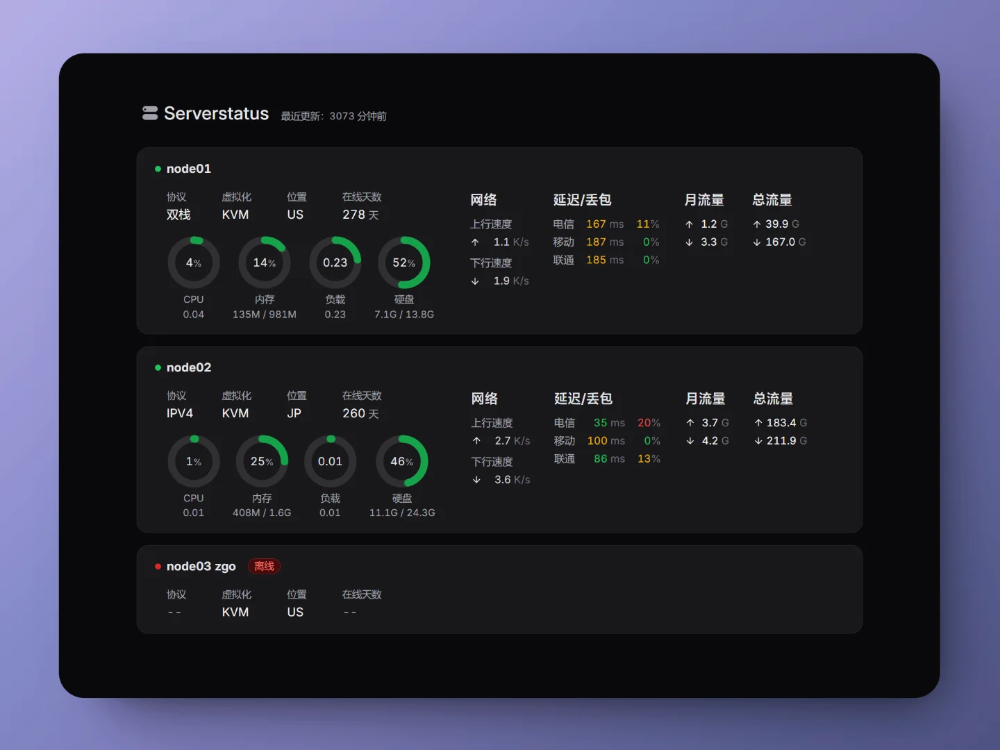

# Glazim Theme

这是一个暗色系的 Serverstatus 主题，圆角设计，~~适合装逼用~~。使用 Next.js 与 Tailwind CSS 构建。



[TOC]

在使用主题之前，你需要先至少部署一个 serverstatus 服务端。

- [cppla/ServerStatus](https://github.com/cppla/ServerStatus)
- [zdz/ServerStatus-Rust](https://github.com/zdz/ServerStatus-Rust)

## 主题部署

### nginx 部署 + 数据反代

解压前端主题至 nginx 网页目录，并将 `stats.json` 反代到 `/json/stats.json`。

以下为操作示例。

```sh
mkdir -p /var/www/html/serverstatus # 解压路径
unzip ~/serverstatus-theme-glazim -d /var/www/html/serverstatus/

# 编辑 nginx 网站配置。不同发行版配置文件路径有区别，请自行替换
vim /etc/nginx/sites-enabled/serverstatus.conf

nginx -s reload
```

对应 nginx 配置文件，部署在 443 端口。

```
server {
	listen 0.0.0.0:443 ssl;
	listen [::]:443 ssl;

	server_name _;

	ssl_certificate /root/cert/fullchain.cer;
	ssl_certificate_key /root/cert/private.key;

	location / {
		root /var/www/html/serverstatus;
		index index.html index.htm;
	}
	location = /json/stats.json {
		proxy_set_header Host $host;
		proxy_set_header X-Real-IP $remote_addr;
		proxy_set_header X-Forwarded-For $proxy_add_x_forwarded_for;
		proxy_set_header X-Forwarded-Proto $scheme;
		proxy_set_header X-Forwarded-Host $host;
		proxy_set_header X-Forwarded-Port $server_port;

		proxy_pass http://127.0.0.1:8080/json/stats.json; # serverstatus 文件url
	}

}
```

重启 nginx 服务后即可访问。

更多说明见 [zdz/ServerStatus-Rust](https://github.com/zdz/ServerStatus-Rust?tab=readme-ov-file#6-faq)。

### Vercel(TODO)


## Build

Build with npm. 

```
git clone https://github.com/sansui233/serverstatus-theme-glazim && cd serverstatus-theme-glazim
pnpm i
pnpm start
```

And place your `stats.json` into `./public/json/`, then run

```
pnpm run build
```

The site is in the `out` directory.


## License

MIT License.